<!-- animated contribution graph: real data, boxes reveal line by line
     (regenerated daily by .github/workflows/update-profile-art.yml) -->

<h3><code>saifullah@github ~ $ ./contributions.sh</code></h3>

 
 

<!-- ascii portrait (left) + neofetch card (right). 370 + 490 = 860 so the
     pair lines up with the heatmap; the card canvas is sized so both panels
     render at the same height.
     portrait: python scripts/prep_photo.py source-photo.jpg && python scripts/make_ascii_svg.py
     card:     python scripts/make_info_card.py -->

<h3><code>saifullah@github ~ $ whoami</code></h3>

<table>
<tr>
<td valign="top"></td>
<td valign="top"></td>
</tr>
</table>

 
 

<h3><code>saifullah@github ~ $ ./links.sh</code></h3>

<b>Full Stack Developer · Automation Architect · AI Workflow Engineer</b>

<!-- TODO: point the Upwork badge at your Upwork profile URL -->

 

<h3><code>saifullah@github ~ $ cat about.md</code></h3>

I engineer high-performance web systems, telephony middleware and self-hosted automation infrastructure. With 5+ years of industry experience and 50+ production systems delivered, I bridge the gap between complex backend engineering and revenue-critical business operations.

My core competency is replacing high-cost SaaS platforms with dedicated, self-hosted infrastructure built on Node.js, Python, PostgreSQL and containerized microservices.

<h3><code>saifullah@github ~ $ ls ~/stack</code></h3>

| Area | Tools |
| :--- | :--- |
| **Frontend** | React · Next.js · TypeScript · Tailwind CSS · JavaScript (ES6+) |
| **Backend** | Node.js · Express · Python (FastAPI, Flask) · PHP |
| **Telephony & real-time** | Asterisk (AGI/AMI) · FreeSWITCH · Drachtio · WebSockets · WebRTC |
| **Mobile** | Kotlin · Android (REST, SQLite, Material Design) |
| **CMS & e-commerce** | Custom WordPress (Gutenberg, ACF Pro) · WooCommerce · Shopify |
| **Orchestration** | n8n (self-hosted clusters) · Docker · Docker Compose · Caddy |
| **Data extraction & ASR** | Playwright · Puppeteer · Whisper · Vosk |
| **Integrations** | REST APIs · OAuth2 · Webhooks · Bidirectional CRM sync |
| **Databases & cache** | PostgreSQL · MySQL · Redis · MongoDB |
| **Performance** | Core Web Vitals optimization: 95+ PageSpeed scores, sub-second TTFB |

<h3><code>saifullah@github ~ $ cat impact.log</code></h3>

| Metric | Result |
| :--- | :--- |
| **Industry experience** | 5+ years in full stack and telephony systems design |
| **Production deployments** | 50+ scalable web and voice AI solutions |
| **Operational efficiency** | Average 70% reduction in manual data tasks |
| **Revenue infrastructure** | Engineered and maintained infrastructure for $1M+ annual operations |

<h3><code>saifullah@github ~ $ ls ~/systems</code></h3>

**Telephony & AI voice middleware**
- **High-throughput dialing middleware:** custom Drachtio and FreeSWITCH integrations handling multi-tenant inbound/outbound call routing with sub-50ms latency.
- **VICIdial integration:** native AGI and API automation for zero-stuck remote agent lifecycles and seamless blind-transfer handoffs.
- **Hybrid ASR pipelines:** real-time speech recognition blending local Vosk streaming with high-accuracy Whisper fallbacks.

**Autonomous data & workflow systems**
- **Lead generation pipelines:** scheduled headless scraping, validation, enrichment and CRM ingestion.
- **SaaS replacement:** migrating multi-step workflows from Zapier and Make to self-hosted n8n, eliminating per-operation costs.
- **Cross-platform synchronization:** real-time, event-driven data replication across e-commerce backends, data lakes and internal dashboards.

<h3><code>saifullah@github ~ $ ls ~/projects --public</code></h3>

| Project | What it does | Built with |
| :--- | :--- | :--- |
| [**Backlink Building Automation & AI Outreach**](https://github.com/saifullahshaukat/Backlink-Building-Automation-AI-Outreach-System) | AI-powered SEO pipeline that automates backlink prospecting, SEO-metric checks, contact discovery and outreach emails previously handled by virtual assistants | Python · HTML/CSS |
| [**Restaurant Inventory Manager**](https://github.com/saifullahshaukat/restaurant-inventory-manager-dashboard) | Inventory, orders, menus, suppliers and profitability dashboard for restaurants and caterers, with stock alerts and cost analysis | React · TypeScript · PostgreSQL |
| [**Android Data Fetching (Web API)**](https://github.com/saifullahshaukat/Android-Data-Fetching-Web-API) | Android app demonstrating REST API integration, local SQLite storage, theme management and Material Design | Kotlin |
| [**Android Quiz & Study Notes**](https://github.com/saifullahshaukat/Android-Application-To-Take-Quiz-Notes) | Study notes and quiz app with state preserved across OS events | Kotlin |

<h3><code>saifullah@github ~ $ cat experience.log</code></h3>

**Project Manager · Lead4s LLC**
- Directed technical strategy for web systems and infrastructure driving $1M+ in annual revenue operations.
- Architected automated data-processing workflows, cutting manual labor by more than 100 hours per month.

**Lead Web Systems Developer · Lead Nationwide**
- Supervised cross-functional teams delivering high-volume lead generation platforms.
- Designed scalable React, Next.js and WordPress environments tailored for high-conversion performance marketing.

 

<code>architecture focus: high availability · strict data ownership · clean, maintainable code</code>

